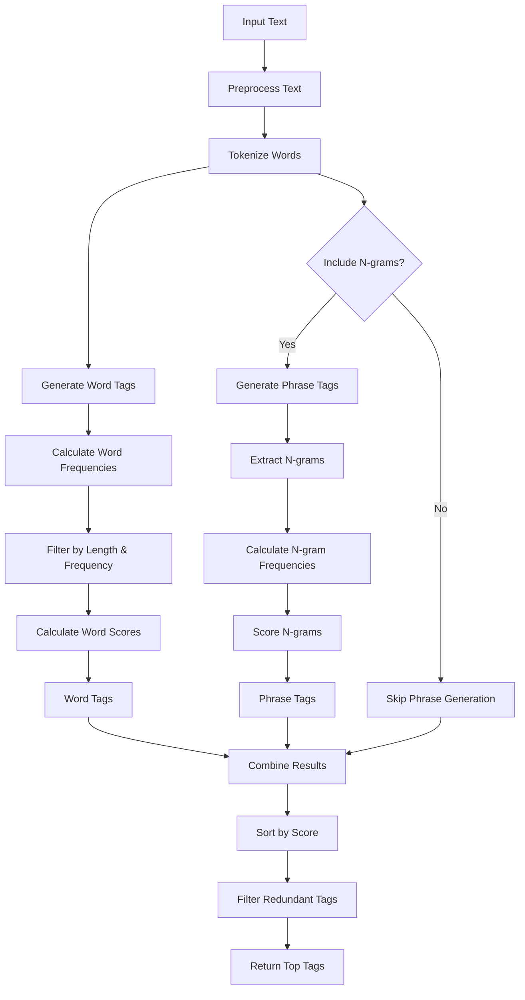

# Tagger - Intelligent Text Tag Generator

An advanced Angular application for generating relevant tags from text content using statistical analysis and natural language processing techniques.

## Overview

Tagger analyzes text to extract the most relevant keywords and phrases, helping users quickly identify important topics and themes. The application uses sophisticated scoring algorithms to evaluate both individual words and multi-word phrases (n-grams) based on frequency, length, and statistical significance.

## Features

- **Word Tag Generation**: Extracts meaningful individual words from text
- **Phrase Tag Generation**: Identifies important multi-word phrases (n-grams)
- **Configurable Options**:
  - Adjust maximum number of tags to generate
  - Set minimum word length and frequency thresholds
  - Control n-gram sizes (specific sizes or size ranges)
  - Toggle case sensitivity
- **Detailed Results**: View tag scores, frequencies, and types
- **Responsive Design**: Works seamlessly on desktop and mobile devices

## Tag Generation Process

The following flowchart illustrates how tags are generated from input text:



## Scoring Methodology

### Word Scoring Factors
- **Term Frequency**: How often the word appears relative to other words
- **Length Bonus**: Longer words receive a higher score (log-scaled)
- **Frequency Significance**: Words with moderate frequency score higher than extremely common or rare words

### Phrase Scoring Factors
- **Component Word Scores**: Average score of individual words in the phrase
- **Phrase Frequency**: How often the exact phrase appears in the text
- **Cohesion Score**: Measures how likely the words appear together vs. independently
- **Length Penalty**: Slight penalty for very long phrases

## Requirements

- **Node.js**: LTS version

## Getting Started

### Installation

```sh
# Install dependencies
npm install
```

### Running the Application

```sh
# Start the development server
npx nx serve tagger

# Access the application at http://localhost:4200/
```

### Building for Production

```sh
# Create a production build
npx nx build tagger
```

## Development

This project was built with Angular and Nx. For more information on the development environment:

```sh
# See available project commands
npx nx show project tagger

# Run tests
npx nx test tagger

# Generate component
npx nx g @nx/angular:component my-component
```

## Technical Implementation

The tag generation is implemented through two main components:
- `TagGeneratorComponent`: Handles the UI and user interactions
- `TextTagGeneratorService`: Contains the core algorithms for tag generation

The service uses a pipeline approach:
1. Text preprocessing and tokenization
2. Word frequency analysis
3. N-gram extraction (for phrases)
4. Statistical scoring of candidates
5. Post-processing to remove redundancy
